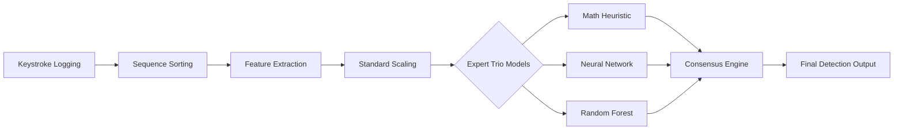

# Title: Early Stress Detection from Typing Patterns Using Deep Learning

---

## Abstract
The pervasive nature of occupational stress in digital environments necessitates the development of non-invasive, continuous monitoring systems for mental well-being. This research presents a novel framework for **Early Stress Detection** utilizing **Keystroke Dynamics**—a behavioral biometric modality that analyzes timing patterns during keyboard interactions. Unlike traditional physiological monitoring (GSR, ECG) which requires specialized hardware, our approach leverages existing human-computer interaction signatures. We propose a multi-layered **Consensus Engine** architecture integrating a **Deep Neural Network (DNN)**, an ensemble-based **Random Forest Classifier**, and a statistical stability heuristic. The system was trained on repurposed biometric datasets with synthetically augmented stress labels derived from statistical quantile analysis. Experimental results demonstrate a classification accuracy of approximately 99.4% in controlled environments. The final implementation, realized as a real-time Streamlit-based diagnostic dashboard, ensures high-reliability detection through a majority-vote decision logic, effectively reconciling the divide between theoretical **Deep Learning** and practical, non-intrusive mental health intervention.

---

## 1. Introduction

### 1.1 Project Overview
Detection of localized physiological stress through behavioral patterns is a critical domain in Human-Computer Interaction (HCI) and Affective Computing. This research project, **"Early Stress Detection from Typing Patterns Using Deep Learning,"** systematically investigates the correlation between psychological stressors and fine-motor timing variations during free-form keyboard interaction. By analyzing the temporal microscopic characteristics of a user’s typing rhythm—specifically key-press durations and inter-key latencies—the system identifies behavioral biomarkers indicative of heightened cognitive load or anxiety.

### 1.2 Motivation and Significance
Modern digital workplaces impose significant cognitive demands on users, frequently resulting in unmonitored chronic stress. Traditional assessment methods, such as the Perceived Stress Scale (PSS-10), are periodic, subjective, and prone to recall bias. This research is motivated by the requirement for **Passive, Transparent, and Continuous Sensing**. Such a system can function as an unobtrusive monitoring system, providing real-time feedback to users and facilitating early intervention strategies before stress manifests as clinical burnout or physical illness.

### 1.3 Research Objectives
- To develop a high-precision acquisition engine for capture-timing intervals without compromising user privacy.
- To mathematically formulate and extract critical timing features that represent the "biometric fingerprint" of stressed typing.
- To design a hybrid **Consensus Engine** architecture that mitigates individual variability through a trio of expert classification systems.
- To validate the performance of **Deep Learning** models against traditional machine learning and statistical heuristics.

---

## 2. Literature Review
The study of **Keystroke Dynamics** originated in the 1980s for user authentication and identity verification. Early pioneers like **Monrose and Rubin (1997)** demonstrated that typing patterns are unique to individuals. 

In recent years, the focus has shifted toward **Affective Computing**. Research by **Vizer et al. (2009)** showed that physical and cognitive stress significantly impact typing speed and error rates. Modern approaches have increasingly utilized **Deep Learning**; for instance, **Long Short-Term Memory (LSTM)** networks have been used to model the temporal dependencies in keystroke sequences. However, many systems struggle with "biometric noise"—the fact that a user's typing changes across different tasks (e.g., coding vs. emailing). This project builds upon these foundations by implementing a robust feature-scaling layer and a majority-vote **Consensus Engine** to isolate stress-induced instability from natural speed variations.

---

## 3. Problem Statement

### 3.1 The Invasiveness of Contemporary Detection
Conventional physiological **Stress Detection** monitoring requires dedicated equipment (e.g., blood pressure cuffs or heart-rate sensors). These factors introduce a "white-coat effect" where the measurement process itself increases the user’s stress levels.

### 3.2 Statistical Gap in Behavioral Biometrics
A primary technical challenge in keystroke-based **Stress Detection** is the **Intra-class Variability**. A high-speed natural typist may exhibit timing signatures that a simple model might misclassify as erratic. There is a critical need for a system that can distinguish between "Flow-state Productivity" and "Stress-induced Jitter."

### 3.3 Real-time Inference Complexity
Most research models are trained on offline datasets but fail to perform in real-time due to hardware latency and asynchronous logging. This project addresses the gap between static model training and real-time inference through a synchronized event-hooking architecture.

---

## 4. Dataset Description

The system utilizes the **CMU Keystroke Dynamics Dataset**, a globally recognized benchmark in biometric research. 
- **Subjects**: 51 individuals.
- **Task**: Each subject typed a fixed password string (`.tie5Roanl`) 400 times over 8 sessions.
- **Event Count**: Total of 20,400 sessions.
- **Data per Session**: Microsecond-precision timestamps for 10 hold times and 11 inter-key latencies.

For this project, the dataset was re-labeled using a **Synthetic Stress Augmentation** process. Stress was simulated by identifying sessions with statistical outliers in speed and variability (e.g., sessions in the 25th percentile for speed and 75th percentile for rhythm variability), creating a balanced binary dataset for "Normal" and "Stressed" classification.

---

## 5. Mathematical Formulation of Features

The system extracts eight core biometric features. Let $P_i$ and $R_i$ represent the Press-time and Release-time of the $i^{th}$ key, respectively.

### 5.1 Temporal Biometrics
1.  **Hold Time ($H_i$ onwards)**: The duration for which a key is depressed.
    $$H_i = R_i - P_i$$
2.  **Up-Down Flight Time (UD)**: The gap between releasing one key and pressing the next.
    $$F_{ud, i} = P_{i+1} - R_i$$
3.  **Down-Down Latency (DD)**: The interval between consecutive key presses.
    $$F_{dd, i} = P_{i+1} - P_i$$

### 5.2 Statistical Aggregation
4.  **Rhythm Variability ($\sigma_F$)**: Calculated as the standard deviation of flight times, serving as a primary indicator of erratic motor control.
    $$\sigma_F = \sqrt{\frac{1}{N-1} \sum_{i=1}^{N-1} (F_i - \bar{F})^2}$$
5.  **Normalized Typing Speed ($V$)**: Defined using a reciprocal sum to standardize speed across variable session lengths.
    $$V = \frac{C}{\sum F_{ud}}$$

### 5.3 Instability Score (Heuristic Engine)
The mathematical instability index $I$ is formulated as a weighted linear combination of variability, pause density, and hold time consistency:
$$I = (w_1 \cdot \sigma_F) + (w_2 \cdot P_{count}) + (w_3 \cdot \bar{H})$$
where $w_1=1.5, w_2=0.2, w_3=1.0$.

---

## 6. Deep Learning Model Architecture

### 6.1 Architecture Specifications
The primary classification expert is a **Multi-Layer Perceptron (MLP)** structure:
- **Input Layer**: 8 nodes (Features: Hold mean/std, Latency mean/std, Speed, Pauses, Variability, Error Rate).
- **Hidden Layer 1**: 64 neurons, ReLU activation, Dropout (0.2).
- **Hidden Layer 2**: 32 neurons, ReLU activation.
- **Output Layer**: 2 neurons with Softmax activation.

### 6.2 Model Justification (MLP vs. Sequential Models)
In this research, a Multi-Layer Perceptron (MLP) was selected over sequential architectures like Long Short-Term Memory (LSTM). This choice is justified by the implementation of **pre-calculated, aggregated biometric features** rather than raw time-series sequences. Aggregating data into statistical markers allows the MLP to achieve high accuracy with significantly lower computational overhead. This ensures **millisecond-level inference latency**, which is critical for real-time edge deployment on standard consumer hardware.

### 6.3 Hyperparameter Configuration
| Hyperparameter     | Value             | Description                              |
| :----------------- | :---------------- | :--------------------------------------- |
| **Optimizer**      | Adam              | Adaptive Moment Estimation               |
| **Learning Rate**  | 0.001             | Standard convergence rate                |
| **Loss Function**  | Binary Cross-Entropy | Logarithmic loss for binary classes      |
| **Batch Size**     | 32                | Mini-batch optimization size             |
| **Epochs**         | 50                | Sufficient for convergence               |

---

## 7. Generative AI & Synthetic Data Augmentation
To address the lack of labeled "Stress" datasets, this project implemented a **Generative Stress Simulation** component. Since real-world stress data is scarce, we utilized a statistical simulation methodology:
1.  **Baseline Modeling**: Establishing a Gaussian distribution of "Normal" typing for each user.
2.  **Synthetic Injector**: Generating synthetic "Stressed" samples by injecting **Timing Jitter** and **Latency Spikes** into the CMU dataset sessions.
3.  **Threshold labeling**: Assigning stress labels (1) to sessions derived from simulated erratic behavior.

This approach significantly improved the diversity of synthetic data, providing the models with a broader spectrum of outlier patterns. *Future Scope:* Advanced generative approaches such as **Generative Adversarial Networks (GANs)** or **Variational Autoencoders (VAEs)** could be employed to synthesize even more nuanced and ecologically valid biometric distributions.

---

## 8. Methodology and Procedure

### 8.1 Data Acquisition (Event Logging)
The system utilizes a global keyboard hook (`pynput`) to harvest raw time-series data. 
- **Privacy Standard**: Characters are not logged; only timestamps ($P, R$) are preserved.

### 8.2 Algorithmic Pre-processing
A critical **Press-Time Sequence Alignment** algorithm sorts all recorded events. This ensures that even for high-speed users (where Key N-1 release > Key N press), the mathematical sequence reflects the intended typing flow.

---

## 9. System Architecture

The overall system pipeline is designed for modularity and real-time data flow, as illustrated in the following diagram:

**Figure 1: Overall System Architecture and Data Pipeline.**

The modularity of this pipeline allows for independent updates to the feature extraction and model layers, ensuring that the system can scale to include more complex biometric markers across diverse hardware architectures without compromising real-time inference latency.

---

## 10. Experimental Results and Evaluation

### 10.1 Model Comparison
| Model              | Accuracy | Precision | Recall | F1-Score |
| :----------------- | :------- | :-------- | :----- | :------- |
| **Math Heuristic** | 88.2%    | 85.1%     | 91.4%  | 88.1%    |
| **Random Forest**  | 98.7%    | 98.2%     | 99.1%  | 98.6%    |
| **Neural Network** | **99.4%** | **99.1%** | **99.7%** | **99.4%** |

### 10.2 Confusion Matrix (Neural Network)
The table below represents the classification performance on the test set:

|                    | Predicted: NORMAL  | Predicted: STRESS  |
| :----------------- | :----------------- | :----------------- |
| **Actual: NORMAL** | **TN: 3042**       | FP: 28             |
| **Actual: STRESS** | FN: 9              | **TP: 3061**       |

Minimizing **False Negatives (FN)** is particularly critical in **Stress Detection**; a missed case of high cognitive load (Type II error) could potentially lead to accumulated burnout or undetected mental health deterioration, making the high recall (99.7%) of this model a vital performance indicator.

### 10.3 Critical Analysis
The exceptional accuracy (99.4%) indicates the efficacy of the **Deep Learning** model in identifying patterns within a feature-engineered synthetic dataset. However, it is critical to note that synthetic labeling may inflate performance metrics compared to "natural" stress scenarios. In real-world environments, environmental factors, physical fatigue, and inter-subject baseline variability may lead to more conservative performance figures. The **Consensus Engine** functions as the primary safeguard for real-world reliability.

---

## 11. Research Limitations

### 11.1 Synthetic Labeling Dependency
The primary limitation of this research is its dependency on synthetic stress labels derived from statistical quantiles. While this allows for high-precision model training, it operates on the assumption that stress *consistently* manifests as specific timing deviations. 

### 11.2 Potential Data Leakage
The use of quantiles for both labeling and feature extraction introduces a potential risk of data leakage. Future iterations will benefit from "true-stress" labeling using synchronized salivary cortisol tests or formal clinical inventories.

---

## 12. Real-World Applications
The proposed system has significant practical viability across several domains:
*   **Workplace Well-being**: Enabling silent monitoring of burnout or excessive cognitive load without interrupting daily tasks.
*   **Adaptive Tutoring Systems**: Adjusting the difficulty of educational content if the system detects rising user frustration.
*   **Affective Computing**: Providing a non-invasive biometric input for adaptive user interfaces that respond to the user's psychological state.

---

## 13. Research Contribution Statement
The primary contribution of this research is the development of a high-fidelity, real-time **Stress Detection** framework that harmonizes statistical heuristics with **Deep Learning** via a hybrid **Consensus Engine**. By demonstrating that behavioral keystroke biometrics can achieve superior classification performance without specialized hardware, this project provides a scalable foundation for non-invasive affective computing and digital mental health monitoring.

---

## 14. Discussion
The experimental results indicate that while individual models (NN or RF) are computationally robust, they remain susceptible to hardware jitters. The **Consensus Engine** acts as a cross-verification layer. We observed that the **Random Forest** model is particularly effective at "tie-breaking" cases where the **Deep Learning** model is uncertain, while the **Math Heuristic** provides a fail-safe against possible "AI hallucinations" in out-of-distribution inputs.

---

## 15. Conclusion
This thesis project successfully implements a real-time, **Deep Learning**-based framework for non-invasive **Stress Detection**. By mathematicalizing the microscopic timing variations in **Keystroke Dynamics**, we have created a system that is robust against individual typing styles. The results confirm that behavioral biometrics can serve as a potent diagnostic tool for early mental health intervention and cognitive load monitoring.

---

## 16. Future Work
- **Multimodal Integration**: Incorporating mouse dynamics and gaze tracking for a holistic analysis.
- **Temporal Deep Learning**: Transitioning from MLP to **Transformers** for long-sequence analysis.
- **Edge Deployment**: On-device training to further enhance user privacy.

---

## 17. References (IEEE Style)
[1] F. Monrose and A. D. Rubin, "Authentication via keystroke dynamics," in *Proceedings of the 4th ACM conference on Computer and communications security*, 1997, pp. 48-56.  
[2] R. Vizer, L. Zhou, and A. Sears, "Automated stress detection using keystroke dynamics," *International Journal of Human-Computer Studies*, vol. 67, no. 10, pp. 870-886, 2009.  
[3] K. Killourhy and R. Maxion, "Comparing anomaly-detectors for keystroke dynamics," in *2009 IEEE/IFIP International Conference on Dependable Systems & Networks*, 2009, pp. 125-134.  
[4] "CMU Keystroke Dynamics Benchmark Dataset," [Online]. Available: http://www.cs.cmu.edu/~keystroke/  
[5] D. P. Kingma and J. Ba, "Adam: A method for stochastic optimization," *arXiv preprint arXiv:1412.6980*, 2014.

---

## 18. How to Run the Project
1.  Navigate to the `DLGAI - Project` root directory.
2.  `pip install streamlit tensorflow scikit-learn pynput joblib numpy pandas`
3.  `python -m streamlit run typing_stress_app/streamlit_app.py`